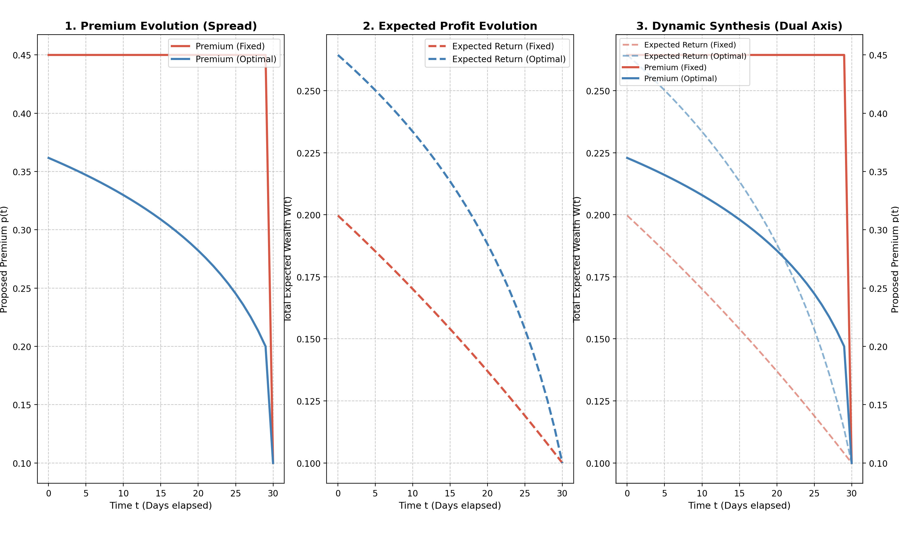

# Optimal Cargo Spread 🚢🛢️

**Dynamic Optimization of the Trading Premium for a Physical Oil Cargo in Transit using a Markov Decision Process.**




## Overview

This repository explores a quantitative approach to physical commodity trading (e.g., Oil, LNG). Unlike financial trading where the goal is often to speculate on the underlying asset's price, physical trading heavily relies on optimizing the **the trading premium (spread)** (the spread) over the market benchmark price before the cargo reaches its destination.

This project implements a **Markov Decision Process (MDP)** to compute the optimal pricing strategy dynamically over time, comparing it against a naive fixed-premium strategy.

## Mathematical Model

The problem is structured as a discrete-time MDP solved via **Dynamic Programming (Backward Induction)**.

* **State ($X$):** $1$ if the entire cargo is unsold (Block trade), $0$ if sold.
* **Action:** Propose a new premium $p_{T-s}$ at each backward time step $s$.
* **Liquidity / Probability of execution:** Instead of a linear probability, this model uses an exponential decay function $D(p) = A \cdot e^{-k \cdot p}$ (inspired by Avellaneda-Stoikov market making models) to realistically simulate how liquidity dries up as the premium increases.
* **Terminal Value ($W_T$):** If the cargo arrives at the port unsold, it is subject to a distress sale penalty (e.g., $W_T = 0.001$).

### Bellman Equation

The expected wealth $W$ is updated backward from maturity $T$, moving backwards by step $s$:

$$W(X_{T-s} = 1) = \max_{p_{T-s}} \left[ D(p_{T-s}) p_{T-s} + (1 - D(p_{T-s})) W(X_{T-s+1} = 1) \right]$$

## Counter-Intuitive Insight

The visualization demonstrates a classic trading dilemma: **greed vs. time**. 
It is counter-intuitive initially, but the model proves that demanding a constant, very high premium yields a *lower* overall expected return than a dynamic premium that decreases over time (reducing margins to secure the sale as the deadline approaches).

## Files Structure

* `optimal_pricing.py`: Contains the Bellman equation solver for the dynamic premium.
* `fixed_pricing.py`: Computes the expected wealth of a static/fixed pricing strategy.
* `visualize_spread.py`: Matplotlib script to generate the comparative analysis charts.

## How to Run

1. Clone this repository.
2. Ensure you have `numpy` and `matplotlib` installed (`pip install numpy matplotlib`).
3. Run the visualization script:
   ```bash
   python visualize_spread.py